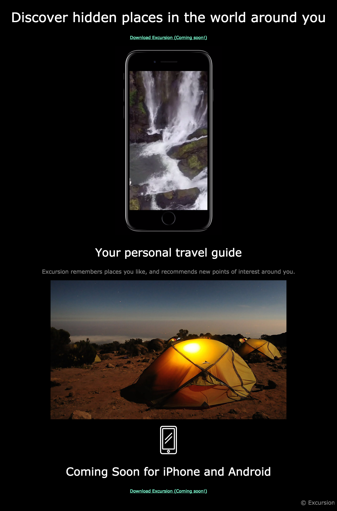

# Project Excursion 

### Project Objective

- To further gain skill using **HTML**, **CSS**, **Command line**, **Git** and **GitHub**.

### Project Tasks

- create new directories from the command 
- Create a new repository in github and link it to local directory
- initiat git in local directory using the command line
- create html document using a visual guide of what the finished product should look like

    - add/commit/push as often as necessary
    - link html to style.css 
    - creat new directories to store image and video data for html document
- create css linked to html using a visual guide

    - add/commit/push as often as necessary

